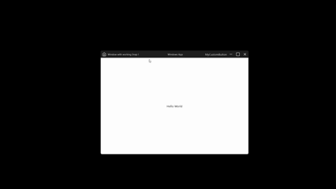

# Compose Windows
[](https://central.sonatype.com/artifact/fr.vyxs.compose.windows/compose-windows-core)
[](https://www.apache.org/licenses/LICENSE-2.0)

Compose Windows is a tiny library to build a **Windows-style custom title bar** in Compose Desktop while keeping **native OS behaviors**: Snap, minimize, maximize, close.  
The DSL stays clean and familiar: `window {}`, `titleBar {}`, `content {}`.

> JVM 21 · Compose Multiplatform · Windows 10/11



---

## What’s new in 0.2.0

- The `WindowsApp { … }` block is now **fully `@Composable`** — use `remember`, `derivedStateOf`, `collectAsState`, etc., directly in the top-level DSL.
- New overload: `WindowsApp(configure) { … }` to separate non-composable window config from composable UI.
- Runtime cleaned up: smaller methods, no nested functions, same native Snap behavior.
- Updated demo with a simple **“plus”** action in the title bar.

---

## Installation

### Gradle (Kotlin DSL)

```kotlin
dependencies {
    implementation("fr.vyxs.compose.windows:compose-windows-core:0.2.0")
}
```

Requires:

* Kotlin 2.2+
* Compose 1.8+
* JVM toolchain 21

---

## Quick start

Use the new overload to separate window config (not composable) and UI (composable):

```kotlin
fun main() = WindowsApp({
    title("Compose Windows — Demo")
    size(960, 640)
    resizable(true)
    cornerRadius(6.dp)
    titleBarColor(Color(0xFF202020))
    titleBarHeight(44.dp)
}) {
    Demo()
}

@Composable
private fun WindowsAppScope.Demo() {
    var counter by remember { mutableStateOf(0) }

    titleBar {
        start {
            Row(Modifier.fillMaxHeight().padding(horizontal = 10.dp), verticalAlignment = Alignment.CenterVertically) {
                Icon(FeatherIcons.Monitor, "App", tint = Color(0xFFE6E6E6))
                Spacer(Modifier.width(8.dp))
                Text("Compose Windows", color = Color(0xFFE6E6E6), fontSize = 14.sp)
            }
        }
        end {
            Row(Modifier.fillMaxHeight(), verticalAlignment = Alignment.CenterVertically) {
                TitleBarButton(backgroundColor = Color(0xFF202020), onClick = { counter++ }) {
                    Icon(FeatherIcons.PlusCircle, "Plus", tint = Color(0xFFE6E6E6))
                }
                Minimize { Icon(FeatherIcons.Minus, "Minimize", tint = Color(0xFFE6E6E6)) }
                Maximize { Icon(FeatherIcons.Square, "Maximize", tint = Color(0xFFE6E6E6)) }
                Close    { Icon(FeatherIcons.X, "Close", tint = Color(0xFFFFEEEE)) }
            }
        }
    }

    content {
        MaterialTheme {
            Box(Modifier.fillMaxSize(), contentAlignment = Alignment.Center) {
                Text("Counter: $counter", color = Color.Black)
            }
        }
    }
}
```

---

## API overview

```kotlin
WindowsApp(block: @Composable WindowsAppScope.() -> Unit)
WindowsApp(configure: WindowConfig.() -> Unit, block: @Composable WindowsAppScope.() -> Unit)

class WindowsAppScope {
  fun window(block: WindowConfig.() -> Unit)
  fun titleBar(block: TitleBarConfig.() -> Unit)
  fun content(block: @Composable () -> Unit)
}

class WindowConfig {
  var title: String
  var width: Int; var height: Int
  var minWidth: Int?; var minHeight: Int?
  var resizable: Boolean
  var cornerRadius: Int
  var titleBarColor: Int
  var titleBarHeight: Int
  fun title(value: String)
  fun size(w: Int, h: Int)
  fun size(w: Dp, h: Dp)
  fun minSize(w: Int, h: Int)
  fun minSize(w: Dp, h: Dp)
  fun minWidth(px: Int); fun minHeight(px: Int)
  fun resizable(isResizable: Boolean)
  fun cornerRadius(radius: Dp)
  fun titleBarColor(color: Color)
  fun titleBarHeight(height: Dp)
}

class TitleBarConfig {
  fun start(block: @Composable TitleBarScope.() -> Unit)
  fun center(block: @Composable TitleBarScope.() -> Unit)
  fun end(block: @Composable TitleBarScope.() -> Unit)
}

class TitleBarScope(val titleBarColor: Color, val actions: WindowActions)
class WindowActions(val minimize: () -> Unit, val toggleMaximize: () -> Unit, val close: () -> Unit)
```

Utility composables for the title bar:

* `TitleBarScope.Minimize(...)`
* `TitleBarScope.Maximize(...)`
* `TitleBarScope.Close(...)`
* `TitleBarButton(...)` (generic)

---

## Notes

* Built for **Windows** (Snap relies on native decorations via FlatLaf).
* Uses **FlatLaf** window decorations to keep OS behaviors.
* Linux/macOS are not primary targets.
* ⚠️ Important: when you place composables inside `start {}`, `center {}`, or `end {}`, that area of the title bar **cannot be used to drag the window**. Currently only the empty space of the title bar is draggable.
---

## Development

Run the sample app:

```bash
./gradlew :sample:run
```

---

## License

Apache-2.0 © Vyxs

**TL;DR**: You can freely use, modify, and redistribute this library (even commercially). You must keep the license notice, but there is **no warranty**: the library is provided *"as is"*. Contributors grant a patent license too, so you’re safe to use it in your projects.